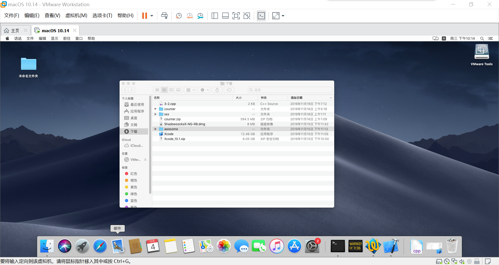
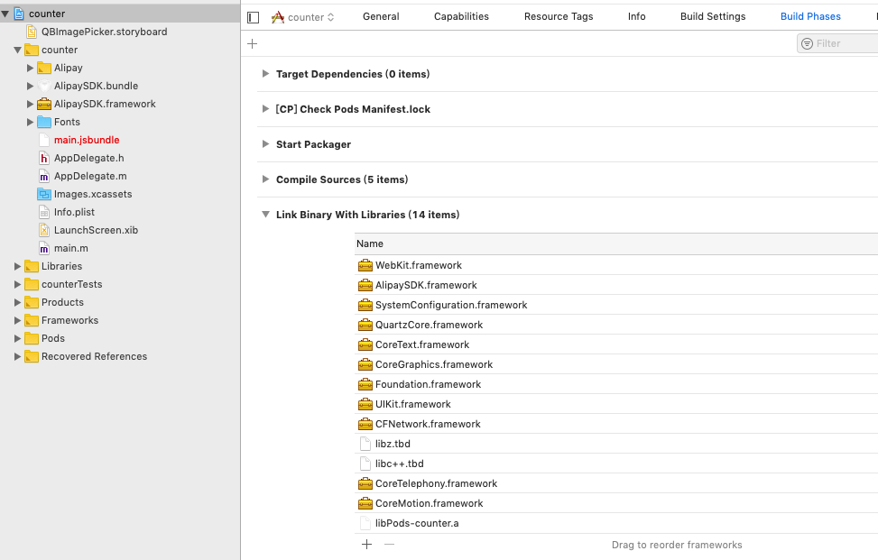
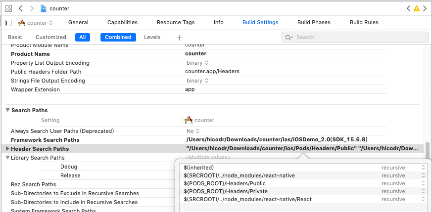

.. post::Dec 6,2019
    :tags:react-native
    :category:react-native
    :author:HicoderDR

react-native扩展:IOS踩坑纪录
#############################################################
.. image:: ../_static/rnmac.png

Apple公司
**不允许非Mac电脑**
开发IOS，编译IOS应用
**必须使用Xcode**
，应用打包
**必须先申请IOS开发者资质（99美刀/年）**
，否则就只能在虚拟机上望梅止渴。

关于申请Apple开发者资质，我整理了一份流程，
`通过链接下载 <http://47.100.107.158/file/apple.pdf>`_

申明，我是个windows+android用户，没有Mac也没有iphone(而这些都是开发IOS的必要条件)。

但是没有办法，需要编译IOS版本，只能硬着头皮上了。

MAC虚拟机配置流程
*******************
黑苹果镜像
+++++++++++++++
为了省下租借（购买）MAC电脑的钱,一定要交社费进入万恶的
`黑苹果社区 <https://osx.cx/>`_

我在这里获取了MacOS mojave 10.14（请安装新版本）的黑苹果镜像（当然，在此你就可以选择另一条道路——安装双系统而非虚拟机）

并通过
`ENFI下载器 <http://www.enfi.cloud/>`_
快速下载了（没有度盘会员的穷你们懂吗）

VMware使用unlocker破解
+++++++++++++++++++++++++++++++
首先提供一下我看的两篇unlocker教程

`VMware 15.5 unlocker <https://www.52pojie.cn/thread-1032336-1-1.html>`_

`VMware 15.0 unlocker <https://www.52pojie.cn/thread-804000-1-1.html>`_

大致流程是 1.任务管理器关闭VMware监控进程  2.以管理员身份运行unlocker

通过unlocker，VMware创建虚拟机中的Mac选项被解锁。

什么？你VMware没激活？这种问题你好意思问吗？

安装MAC虚拟机
++++++++++++++++++++++++++++++
准备好Apple账号

按照
`VM安装MAC教程 <https://www.52pojie.cn/thread-804000-1-1.html>`_
一步步走下来之后，苹果系统已经可以正常使用。

然后个人使用区别的感触：

.. list-table::

    * - 不适处
      - Windows
      - Mac
    * - 窗口按钮
      - 在窗口右上角
      - 在窗口左上角
    * - 软件menu位置
      - 窗口左上方，跟随窗口
      - 固定在屏幕左上方

按钮换个位置我也能适应，但这个菜单位置真是时常让我有种质壁分离的错觉。

MAC terminal proxy 代理
*********************************
在MAC上使用SSR、SR等科学上网工具要注意一点————全局模式也不会影响terminal

所以需要额外对terminal进行proxy设置

参考
`Mac terminal终端配置代理 <https://www.jianshu.com/p/9c93f9484b0d>`_

配置react-native运行环境
************************************
`react-native官网教程 <https://reactnative.cn/docs/getting-started.html>`_

首先打开科学上网工具，安装
**Node**
、
**Watchman**
和 
**React Native命令行工具**
以及
**Xcode**
（从
`Apple官网 <https://developer.apple.com/download/more/>`_
下载）
。

RN的要求是Xcode 10及以上，我下载了Xcode 10.1，追悔莫及,一定要下载最新的版本（非bata、dev）。

为什么这么说，这是因为之后的很多bug，我在stackoverflow上搜索时，见到了这样的解决办法:
    I updated Xcode 10.1 to Xcode 11.1 and then the problem fixed.

我看到这个都要哭出来了----

安装成功后

**react-native init xxx**

**cd ./xxx**

**react-native run-ios**

成功运行了样例

将RN项目移植到MAC环境下运行
************************************
本以为移植过来直接run-ios就可以了，结果死的很惨系列

红屏镇楼

因为不知道到底是哪个第三方模块出了问题，只好逐个排查

第三方模块的逐个重新安装
+++++++++++++++++++++++++++
首先

思路是一个个装，装到哪个出了问题就肯定是哪个了

血与泪的纪录，找出四个害人精
::

    yarn add native-base
    yarn add react-navigation
    yarn add react-native-gesture-handler
    yarn add react-native-material-ui
    yarn add @react-native-community/async-storage
    yarn add react-native-vector-icons
    #第一个害人精

    yarn add react-native-share
    yarn add react-native-image-crop-picker
    #第二个害人精

    yarn add react-native-image-zoom-viewer
    yarn add react-native-yunpeng-alipay
    #第三个害人精

    yarn add react-native-swiper
    yarn add react-native-image-pan-zoom
    yarn add react-native-img-cache
    yarn add react-native-image-progress
    yarn add react-native-progress
    #第四个害人精

    yarn add react-native-fetch-blob
    yarn add react-navigation-stack

react-native-vector-icons 图标库
------------------------------------
这个问题很普遍，很快就找到了
`对应的解决办法 <https://www.cnblogs.com/evai/p/5804751.html>`_

react-native-image-crop-picker 相机相册
------------------------------------------
报错是QBimagepicker的问题，这让我想起了当初使用这个库的时候有一大段看不懂的文字。

通过仔细阅读
`react-native-crop-picker文档 <https://github.com/ivpusic/react-native-image-crop-picker>`_
中的Post-install steps-IOS 解决。

react-native-yunpeng-alipay 支付宝支付
----------------------------------------
这个组件是真的害人，他没有编译ios版本，很快我就使用了
`新的支付宝接入的实现方法 <https://www.jianshu.com/p/0728c30820c3>`_
。然而，这并没有什么卵用，只要想上架APPStore，就必须使用AppStore内购（IAP）。

react-native-progress 加载动画
---------------------------------------
这个组件库很棒，但为啥出了问题呢？

因为在IOS里，作为基础库的react-native-art不会被默认导入，但android里是预编译的。

具体方法参考了很多博客：
    Go the Build Phase tab of YOUR PROJECT, add libART.a into Link Binary into Libraries.

过程中出现了include失败的问题，将search header files中的方式改为recursive（递归地）并添加一些头文件目录

IPhone X屏幕适配
+++++++++++++++++++++++
历经九九八十一难，项目终于成功跑起来了。

然后遇到了屏幕适配问题，Iphone X已经升级成全面屏，屏幕下方60px高度被系统键占用。

::

    const X_WIDTH = 375;
    const X_HEIGHT = 812;
    const SCREEN_WIDTH = Dimensions.get('window').width;
    const SCREEN_HEIGHT = Dimensions.get('window').height;

    const isiosx= (Platform.OS === 'ios' &&
        ((SCREEN_WIDTH === X_WIDTH && SCREEN_HEIGHT === X_HEIGHT) 
        ||(SCREEN_WIDTH === X_HEIGHT && SCREEN_HEIGHT === X_WIDTH)));

通过判断IOS X来对组件进行调整，EZ。