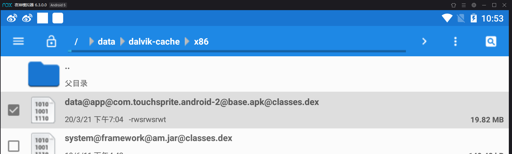
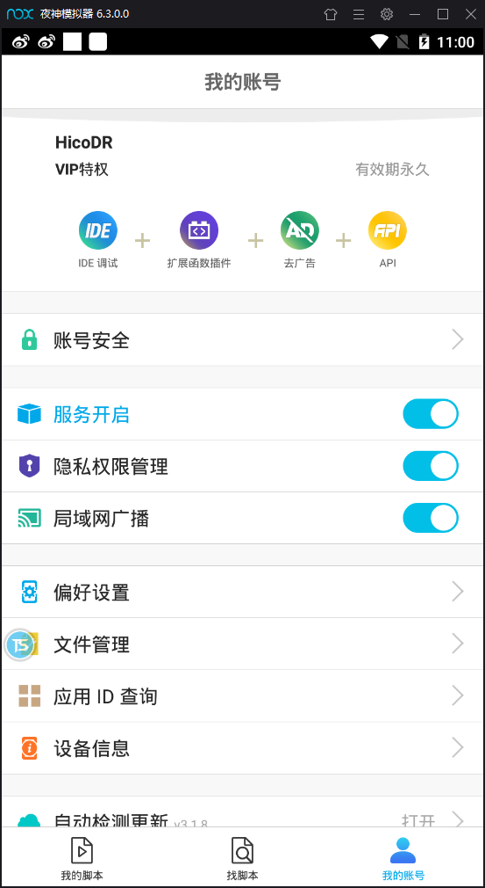
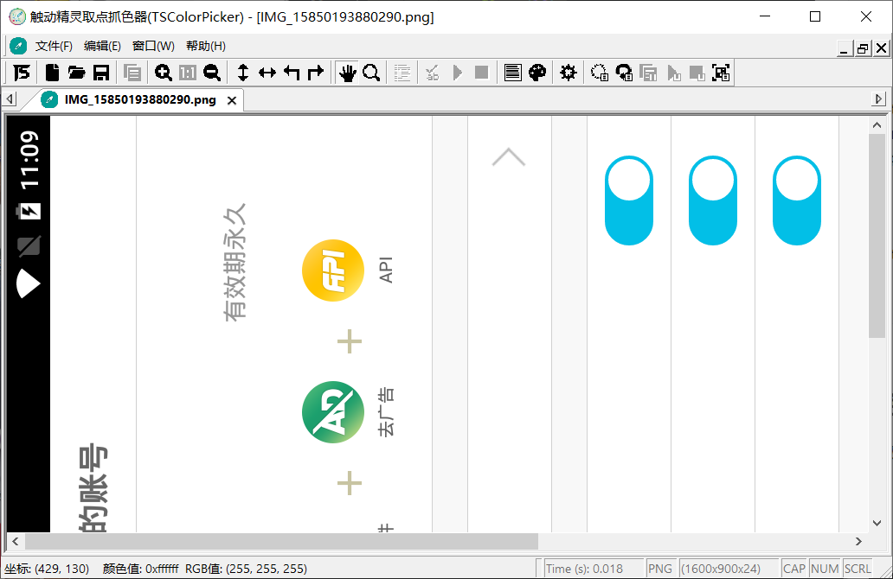

# 触动精灵-Android自动化测试脚本

## 主要任务

### 目标

自动化完成网易云中的10个账户的投票打榜

### 流程

1. 登陆网易云音乐账号
2. 搜索栏输入“周深榜投”
3. 关注 用户-周深榜投组
4. 依次点击 动态中的约五十条链接
5. 在链接中的网页点击投票后退出
6. 切换下一个账号

### 工具

1. 触动精灵
2. 夜神安卓模拟器（也可用真机，但需要root）

## 触动精灵

可以调试运行LUA脚本的手机自动化辅助工具

至于用途吗....比如刷手游，科技肝之类的。

## 夜神模拟器

### 安装模拟器

直接安装即可

### 安装触动精灵

打开模拟器->应用中心，搜索触动精灵，安装即可

下载网易云音乐并更新（不然无法打开助力页面）

打开触动精灵。

#### 如果打开报错

文件管理器 找到如下



然后右上角找到属性，赋予全部权限


#### 注册账号并登陆

打开TS_studio IDE，按照说明，前往官网注册账号，并输入access Key，IDE才可以使用。
同理，注册完后需要在触动精灵APP上登陆，才可以使用。

#### 开始连接

确保服务和局域网广播都开启着

找到触动精灵中的 我的->设备信息，记下设备的IP地址

信息 记下IP

打开TS_studio,在设备栏新增设备（输入IP），然后右键 连接到设备，console log显示连接成功 即可。

如果有问题就检查局域网和账号是否登陆。


### 代码

直接写lua脚本就行了

运行点IDE中的绿色运行，停止：在模拟器中点触动精灵悬浮窗->停止。

目前是 在网易云首页开始运行。

search（） 搜索周深榜投
prepare（） 进入到动态页面
go（） 投票
switch（） 没高兴写完，为切换账号

```lua

function tap(x,y)
    touchDown(x,y)
    mSleep(50)
    touchUp(x,y)
end

function login(username,password)
    tap(430,650)
    mSleep(1000)
    inputText(username)

    tap(520,650)
    mSleep(1000)
    inputText(password)

    tap(610,650)
end


function search()
    tap(100,50)
    mSleep(1000)
    tap(110,750)
    mSleep(1000)
    inputText("周深榜投")
    mSleep(1000)
    tap(210,750)
    mSleep(2000)
end


function prepare()
    touchDown(190, 300)
    for i = 0, 500, 50 do
        touchMove(190,300+i)
        mSleep(30)
    end
    touchUp(191, 800)

    mSleep(2000)
    tap(190,70)
    mSleep(2000)
    tap(300,700)
    mSleep(2000)
    tap(640,210)
    mSleep(2000)
end

function go()
    x,y = findMultiColorInRegionFuzzy( 0x8c5131, "-30|24|0xd60410,-28|-12|0xd6d3e7,6|28|0xffeff7", 90, 0, 0, 1599, 899)
    tap(x,y)
    mSleep(3000)
    if getColor(785, 670)==0xdcc3a2 then
        tap(780,450)
        mSleep(1000)
    end
    tap(100,850)
    mSleep(500)

    touchDown(750,410)
    for i = 0, 500, 50 do
        touchMove(750-i, 410)
        mSleep(10)
    end
    touchUp(250, 411) 
    mSleep(1000)
end

function switch()
	for i =1,4,1 do
		tap(100,850)
		mSleep(1000)
	end
	tap(1550,460)
	mSleep(1000)
	for j = 0,3,1 do
		touchDown(1500,410)
		for i = 0, 1000, 50 do
			touchMove(1500-i, 410)
			mSleep(10)
		end
		touchUp(0, 410) 
		mSleep(1000)
	end
	tap(1550,450)
	mSleep(1000)
	tap(875,150)
	mSleep(1000)
	tap(1540,655)
	mSleep(1000)
	tap(1450,380)
end

init(0)
search()
prepare()
for j=0,40,1 do
	go()
end
switch()

```


### 取色器使用

打开取色器，最右方为获取屏幕截图

左下角可以读出每个像素点坐标

菜单栏中有一个取色板，在图上按Enter 取色，打开取色板可以生成取色判断脚本。