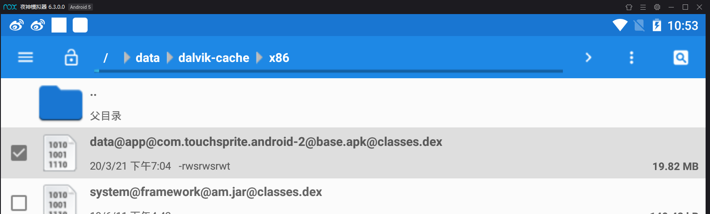
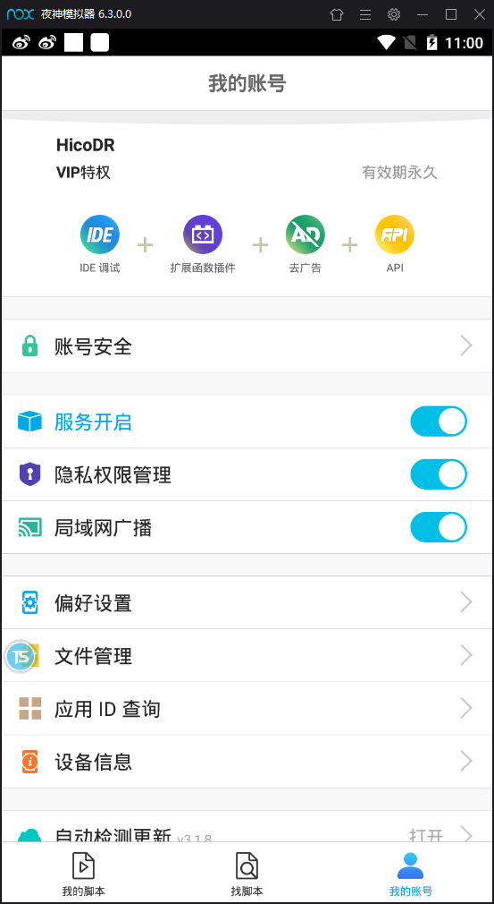
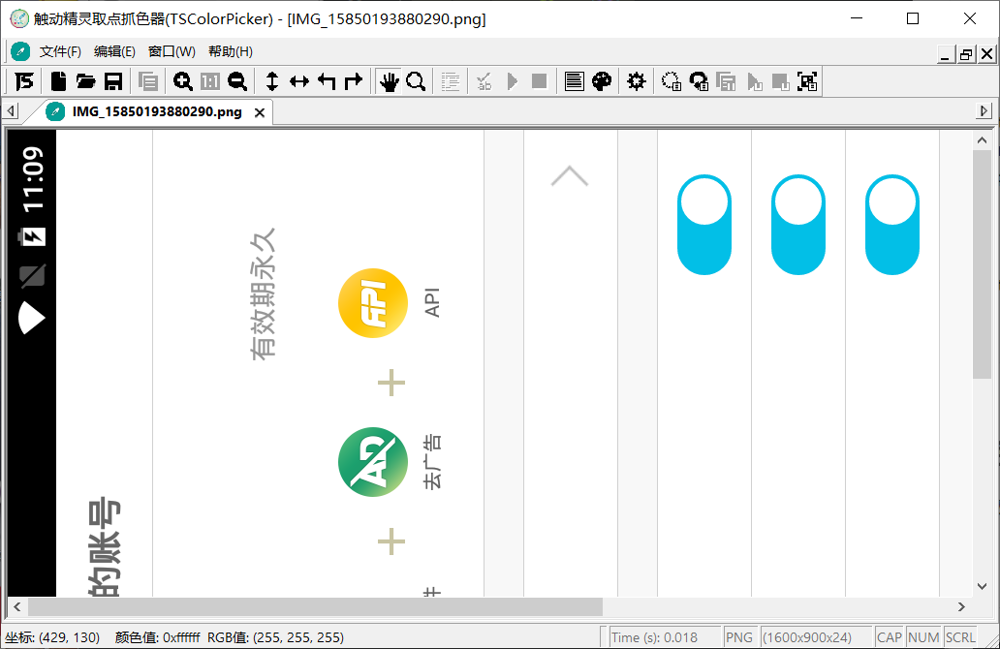

.. _header-n0:

触动精灵-Android自动化测试脚本
==============================

.. _header-n3:

主要任务
--------

.. _header-n4:

目标
~~~~

自动化完成网易云中的10个账户的投票打榜

.. _header-n11:

.. image:: ../_static/touchsprite.gif

流程
~~~~

1. 登陆网易云音乐账号

2. 搜索栏输入“周深榜投”

3. 关注 用户-周深榜投组

4. 依次点击 动态中的约五十条链接

5. 在链接中的网页点击投票后退出

6. 切换下一个账号

.. _header-n13:

工具
~~~~

1. 触动精灵

2. 夜神安卓模拟器（也可用真机，但需要root）

.. _header-n44:

触动精灵
--------

可以调试运行LUA脚本的手机自动化辅助工具

至于用途吗....比如刷手游，科技肝之类的。

.. _header-n54:

夜神模拟器
----------

.. _header-n55:

安装模拟器
~~~~~~~~~~

直接安装即可

.. _header-n57:

安装触动精灵
~~~~~~~~~~~~

打开模拟器->应用中心，搜索触动精灵，安装即可

下载网易云音乐并更新（不然无法打开助力页面）

打开触动精灵。

.. _header-n61:

如果打开报错
^^^^^^^^^^^^

文件管理器 找到如下

然后右上角找到属性，赋予全部权限

.. _header-n67:

注册账号并登陆
^^^^^^^^^^^^^^

| 打开TS_studio IDE，按照说明，前往官网注册账号，并输入access
  Key，IDE才可以使用。
| 同理，注册完后需要在触动精灵APP上登陆，才可以使用。

.. _header-n69:

开始连接
^^^^^^^^

确保服务和局域网广播都开启着

找到触动精灵中的 我的->设备信息，记下设备的IP地址

|image0|\ 信息 记下IP

打开TS_studio,在设备栏新增设备（输入IP），然后右键 连接到设备，console
log显示连接成功 即可。

如果有问题就检查局域网和账号是否登陆。

.. _header-n76:

代码
~~~~

直接写lua脚本就行了

运行点IDE中的绿色运行，停止：在模拟器中点触动精灵悬浮窗->停止。

目前是 在网易云首页开始运行。

| search（） 搜索周深榜投
| prepare（） 进入到动态页面
| go（） 投票
| switch（） 没高兴写完，为切换账号

.. code:: lua

    --封装点击函数
    function tap(x,y)
        touchDown(x,y)
        mSleep(50)
        touchUp(x,y)
    end

    --登陆
    function login(username,password)
        tap(430,650)
        mSleep(1000)
        inputText(username)

        tap(520,650)
        mSleep(1000)
        inputText(password)

        tap(610,650)
    end

    --搜索“周深榜投”
    function search()
        tap(100,50)
        mSleep(1000)
        tap(110,750)
        mSleep(1000)
        inputText("周深榜投")
        mSleep(1000)
        tap(210,750)
        mSleep(2000)
    end

    --进入动态页面
    function prepare()
        touchDown(190, 300)
        for i = 0, 500, 50 do
            touchMove(190,300+i)
            mSleep(30)
        end
        touchUp(191, 800)

        mSleep(2000)
        tap(190,70)
        mSleep(2000)
        tap(300,700)
        mSleep(2000)
        tap(640,210)
        mSleep(2000)
    end

    --投票一次并下滑
    function go()
        x,y = findMultiColorInRegionFuzzy( 0x8c5131, "-30|24|0xd60410,-28|-12|0xd6d3e7,6|28|0xffeff7", 90, 0, 0, 1599, 899)
        tap(x,y)
        mSleep(3000)
        if getColor(785, 670)==0xdcc3a2 then
            tap(780,450)
            mSleep(1000)
        end
        tap(100,850)
        mSleep(500)

        touchDown(750,410)
        for i = 0, 500, 50 do
            touchMove(750-i, 410)
            mSleep(10)
        end
        touchUp(250, 411) 
        mSleep(1000)
    end

    --切换账户
    function switch()
        for i =1,4,1 do
            tap(100,850)
            mSleep(1000)
        end
        tap(1550,460)
        mSleep(1000)
        for j = 0,3,1 do
            touchDown(1500,410)
            for i = 0, 1000, 50 do
                touchMove(1500-i, 410)
                mSleep(10)
            end
            touchUp(0, 410) 
            mSleep(1000)
        end
        tap(1550,450)
        mSleep(1000)
        tap(875,150)
        mSleep(1000)
        tap(1540,655)
        mSleep(1000)
        tap(1450,380)
    end

    init(0)
    search()
    prepare()
    for j=0,40,1 do
        go()
    end
    switch()

.. _header-n83:

取色器使用
~~~~~~~~~~

打开取色器，最右方为获取屏幕截图\ |image1|

左下角可以读出每个像素点坐标

菜单栏中有一个取色板，在图上按Enter
取色，打开取色板可以生成取色判断脚本。

