.. post::Dec 13,2019
    :tags:python
    :category:python
    :author:HicoderDR

Fiddler:借助抓包工具写手机APP的Python脚本
#############################################################

本篇日志记载我使用python实现每日自动领取 
`微博动漫app <http://manhua.weibo.com/>`_
福利的过程。

抓包工具Fiddler4
*************************
下载
++++++++++++++++++
`Fiddler官网 <https://www.telerik.com/fiddler>`_ 
从这里下载Fiddler

配置
++++++++++++++++++
打开Fiddler,Tools-> Fiddler Options 。（配置完后记得要重启Fiddler）.

1.选中"Decrpt HTTPS traffic",    Fiddler就可以截获HTTPS请求

2.选中"Allow remote computers to connect".  是允许别的机器把HTTP/HTTPS请求发送到Fiddler上来

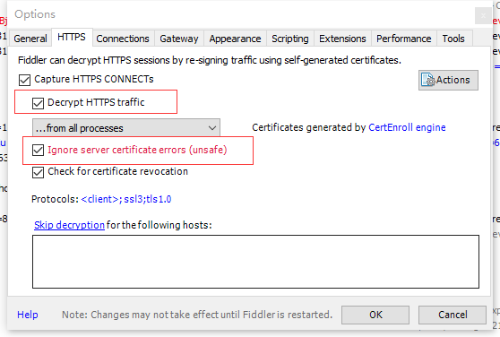

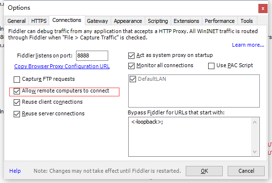

连接手机抓包
++++++++++++++
首先确保手机和电脑连接在同一个wifi下

通过
**ipconfig**
指令查阅本机IPv4地址

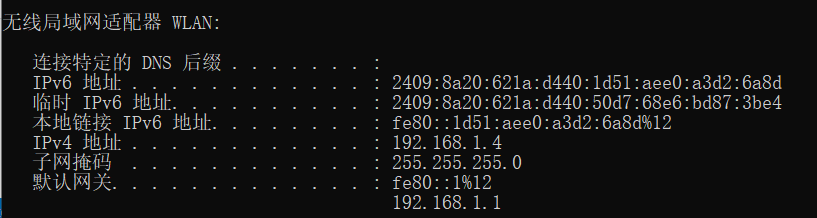

然后对手机wifi进行代理配置，以我的oppo R11 Plus为例

点击WIFI详情，设置代理为手动，并配置代理IP和端口号8888

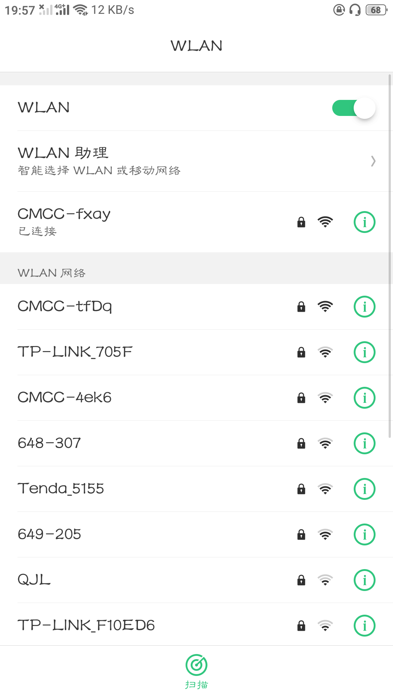

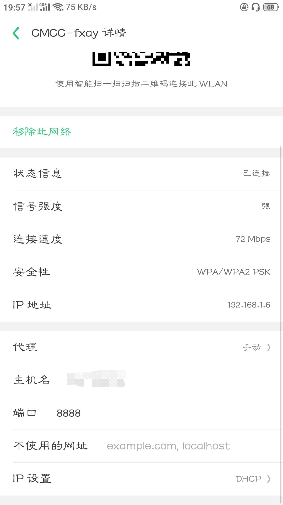

配置完毕手机上发送的请求应该已经能够通过fiddler抓取

微博动漫
***************************
打开微博动漫APP的福利页
++++++++++++++++++++++++
点击领取后观察Fiddler

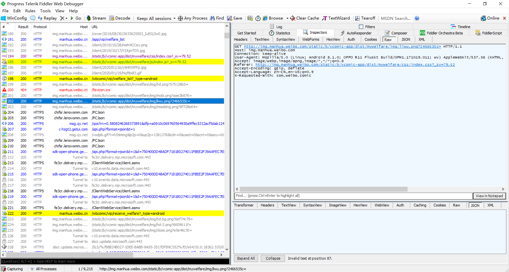

找到
**领取福利**
的相关请求welfare_list和receive_welfare

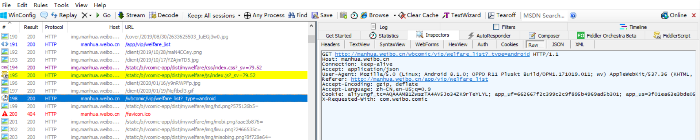

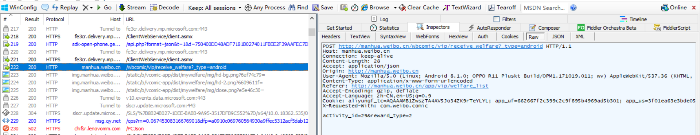

postman模拟
++++++++++++++++++++++++++
首先只进行一般的模拟，即只设置header中的User-Agent就可以获取到welfare_list

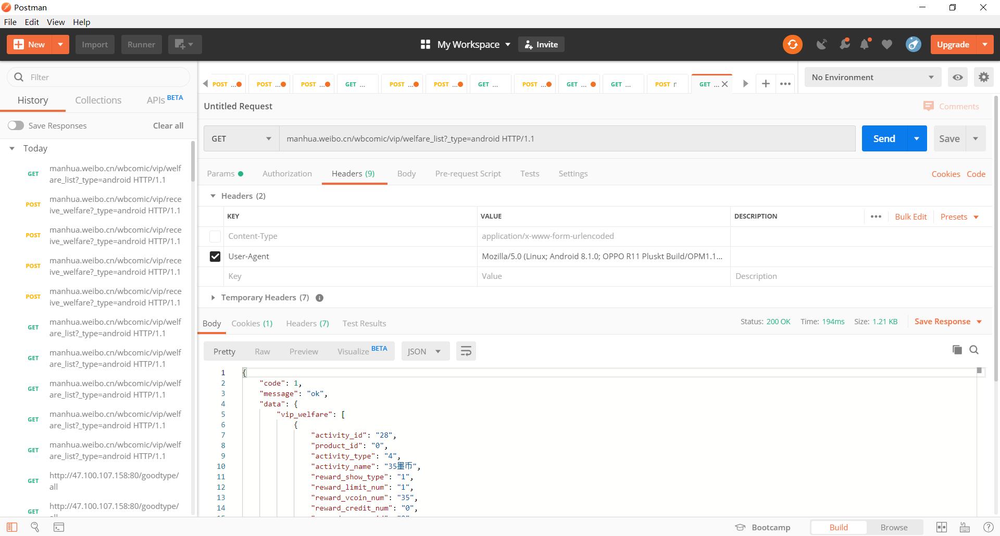

同理，只要将全部header都抄取过来，就可以完全模拟手机APP登录态的环境

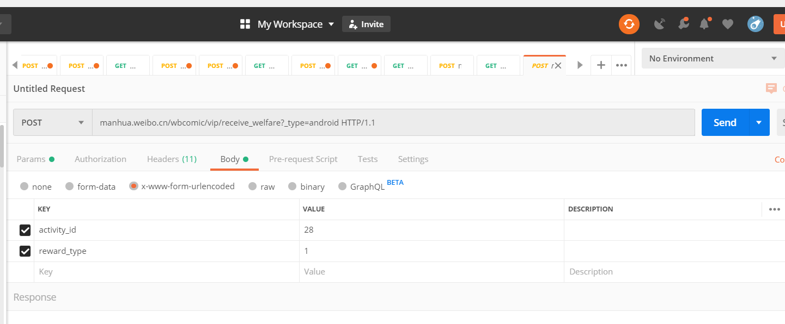

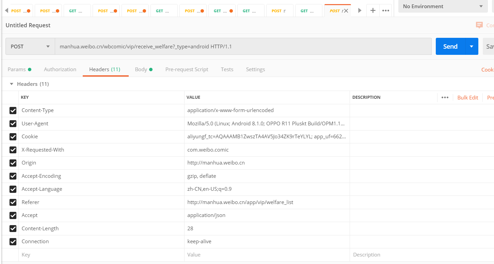

过程中我经历了
**多种结果**
，终于成功复现了

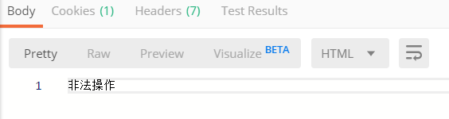

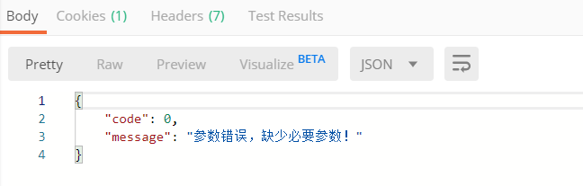

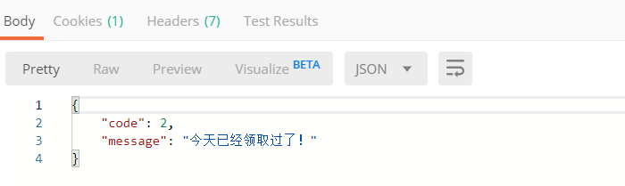

接下来只需要使用Python或Java设置定时任务发送请求即可

Python脚本
********************************

首先写一份单次运行

::

    import requests
    import json
    from urllib import parse

    path='http://manhua.weibo.cn/wbcomic/vip/receive_welfare?_type=android HTTP/1.1'
    #复现的Headers
    headers = {
        'Connection': 'keep-alive',
        'Content-Length': '28',
        'Accept': 'application/json',
        'Origin': 'http://manhua.weibo.cn',
        'User-Agent': 'Mozilla/5.0 (Linux; Android 8.1.0; OPPO R11 Pluskt Build/OPM1.171019.011; wv) AppleWebKit/537.36 (KHTML, like Gecko) Version/4.0 Chrome/62.0.3202.84 Mobile Safari/537.36',
        'Content-Type': 'application/x-www-form-urlencoded',
        'Referer': 'http://manhua.weibo.cn/app/vip/welfare_list',
        'Accept-Encoding': 'gzip, deflate',
        'Accept-Language': 'zh-CN,en-US;q=0.9',
        'Cookie': 'xxxxxxxxxxxxxxxxxxxxxxxxxxxxxxxxxxxx',
        'X-Requested-With': 'com.weibo.comic',
    }
    #领取墨币
    body = {
        "activity_id":"28",
        "reward_type":"1",
    }
    #领取喵饼
    body2={
        "activity_id":"29",
        "reward_type":"2",
    }
    data = parse.urlencode(body)
    resp=requests.post(path,headers=headers,data=data)
    print(json.loads(resp.text).get("message"))

再套上这个Timer(定时任务)的模板
++++++++++++++++++++++++++++++++++++
::

    from threading import Timer

    #每次执行的任务写在func里
    def func():
        pass

    class RepeatingTimer(Timer): 
        def run(self):
            while not self.finished.is_set():
                self.function(*self.args, **self.kwargs)
                self.finished.wait(self.interval)
    #设置每隔n秒执行
    t = RepeatingTimer(1,func)
    t.start()

完整代码下载
++++++++++++++++++++
挂在我可怜的学生服务器上了，
`点这里就行 <http://47.100.107.158/file/webocomic.py>`_