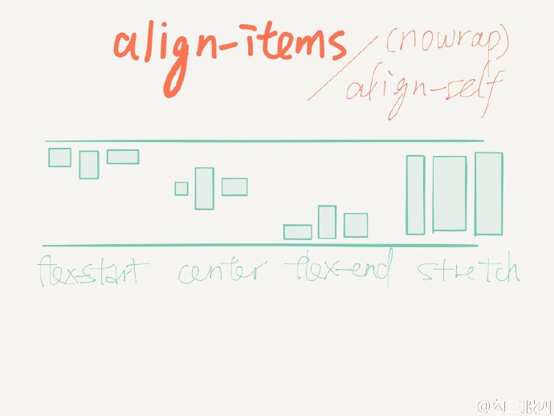

.. post::Sep 23,2019
    :tags:react-native
    :category:react-native
    :author:HicoderDR

react-native初识:布局和CSS样式、第三方库的引入
#####################################################
如果没有听说过CSS

`这里是W3School学习链接 <https://www.w3school.com.cn/css/index.asp>`_

`这里是菜鸟教程连接 <https://www.runoob.com/css/css-tutorial.html>`_

如何对一个视图（View）设置style
++++++++++++++++++++++++++++++++
1.直接设置style
::

    import React, { Component } from 'react'
    import {
        Text,
        View,
        Dimensions,
        StyleSheet,
    } from 'react-native'

    export default class A extends Component {
        render(){
            return(
                #Tips: 第一个大括号是指里面为一个自定义变量（对象）
                #      第二个大括号则指这个变量是一个多属性的结构体
                <View style={{flex:1,alignItems: 'center',flexDirection: 'row'}}>
                    <Text style={{fontSize:18}}> 
                        native words
                    </Text>
                </View>
            );
        }
    }

2.内联样式表
::

    import React, { Component } from 'react'
    import {
        Text,
        View,
        Dimensions,
        StyleSheet,
    } from 'react-native'
    #通过引入Dimensions获取屏幕宽高
    const screenW = Dimensions.get('window').width;
    #通过引入StyleSheet创建css样式表
    const styles = StyleSheet.create({
        container: {
            flex: 1,
            alignItems: 'center',
            flexDirection: 'row',
        },
        text:{
            fontSize:18,
        }
    })

    export default class A extends Component {
        render(){
            return(
                <View style={styles.container}>
                    <Text style={styles.text}> 
                        native words
                    </Text>
                </View>
            );
        }
    }

3.外联样式表

外联即将样式表写在另一个文件中，
使用时通过import导入
:: 

    import styles from "./mystyle"

如果使用外联改善代码结构，则建议
`学习Less <http://lesscss.cn/>`_

相比于CSS,
**LESS**
增加了变量、Mixin、函数等特性，使 CSS 更易维护和扩展。

Layout（布局）
++++++++++++++++++++++++++++++++
布局就是组件排列的方式，我们通过调整、嵌套布局来完成对

1. `FlexBox布局 <https://reactnative.cn/docs/flexbox/>`_
------------------------------------------------------------
原生React-native采用的布局方法

这里是一份手绘图解,帮助您更快的掌握Flexbox

.. image:: ../_static/flexbox1.jpg 

.. image:: ../_static/flexbox2.jpg 

.. image:: ../_static/flexbox3.jpg 

.. image:: ../_static/flexbox5.jpg 

2. `react-native-easy-grid <https://github.com/GeekyAnts/react-native-easy-grid>`_
----------------------------------------------------------------------------------------------
github网址：https://github.com/GeekyAnts/react-native-easy-grid

easy-grid使用方法极其简单，
通过组合、嵌套实现复杂的布局

在这里必须要吹爆
`NativeBase <https://docs.nativebase.io/>`_
，这是我使用过的最赞的RN第三方UI组件库了
，easy-grid只是nativebase中的一部分而已。

简单的使用示意：
::

    <Grid>
        <Col>
            <Text>1</Text>
        </Col>
        <Col>
            <Row>
                <Text>2</Text>
            </Row>
            <Row>
                <Text>3</Text>
            </Row>
        </Col>
    </Grid>

.. image:: ../_static/easy-grid.png 

如何引入第三方库
++++++++++++++++++++++++++++++++
在github或者RN社区上有很多好用的第三方库

打开他们的github网址，
跟随Install说明完成操作
，就可以使用第三方库了

通用的自动添加依赖方法（Automatic Ways）
------------------------------------------
RN version>=0.60:
    yarn add xxx

RN version<0.60:
    npm install xxx

    react-native link xxx

手动方法(Manual Ways)
-----------------------------
阅读具体的Install说明

一般会涉及的文件:
    /andriod/app/build.gradle
    /android/app/.../MainApplication