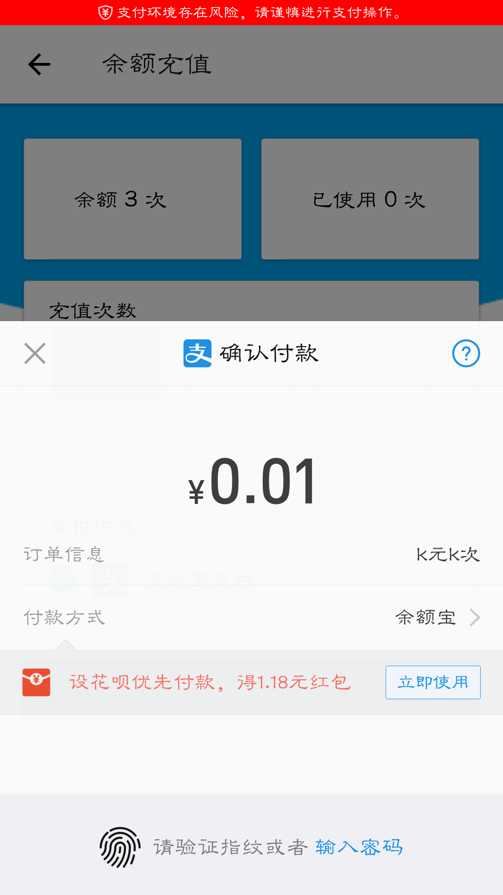
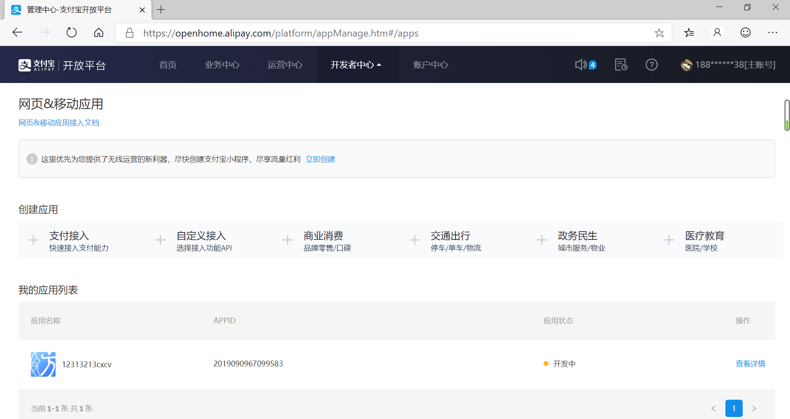
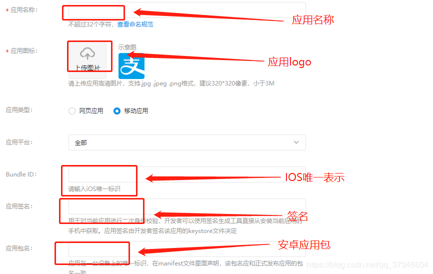
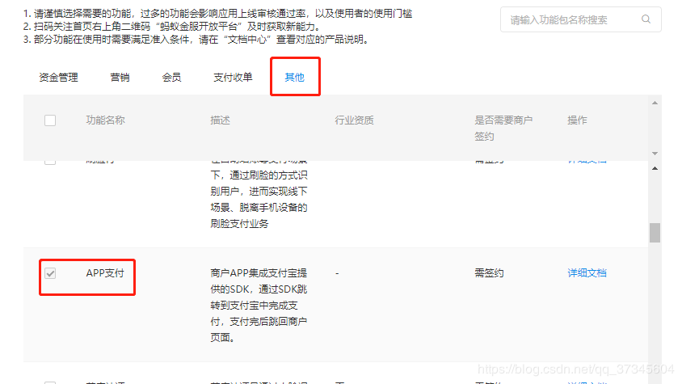

.. post::Oct 17,2019
    :tags:react-native
    :category:react-native
    :author:HicoderDR

react-native实战:支付宝接入app支付
#############################################################

效果如下：

支付宝开放平台配置
**************************
首先商户入驻，选择支付接入，并添加自己的app

添加app支付的功能，同时按照平台内指示建立RSA2密钥

springboot后台配置
**************************
1.首先在maven中引入SDK
++++++++++++++++++++++++++++++
::

    <!-- 支付宝支付 SDK  -->
    <dependency>
        <groupId>com.alipay.sdk</groupId>
        <artifactId>alipay-sdk-java</artifactId>
        <version>3.7.4.ALL</version>
    </dependency>

2.然后新建一个AlipayConfig类，存储私密的token
++++++++++++++++++++++++++++++++++++++++++++++++++++
::

    public class AlipayConfig {
        # 应用ID,您的APPID，收款账号既是您的APPID对应支付宝账号,开发时使用沙箱提供的APPID，生产环境改成自己的APPID
        public static String APP_ID = "2019xxxxxxxxx";
        # 商户私钥，您的PKCS8格式RSA2私钥
        public static String APP_PRIVATE_KEY ="xxxxxxxxx";
        # 支付宝公钥,查看地址：https://openhome.alipay.com/platform/keyManage.htm 对应APPID下的支付宝公钥。
        public static String ALIPAY_PUBLIC_KEY = "xxxxxxxx";
        # 服务器异步通知页面路径  需http://格式的完整路径，不能加?id=123这类自定义参数，必须外网可以正常访问
        public static String notify_url = "http://localhost:port/notify";
        # 页面跳转同步通知页面路径 需http://格式的完整路径，不能加?id=123这类自定义参数，必须外网可以正常访问(其实就是支付成功后返回的页面)
        public static String return_url = "http://localhost:port/alipay.trade.page.pay-JAVA-UTF-8/return_url.jsp";
        # 签名方式
        public static String sign_type = "RSA2";
        # 字符编码格式
        public static String CHARSET = "utf-8";
        # 支付宝网关，这是沙箱的网关
        public static String gatewayUrl = "https://openapi.alipay.com/gateway.do";

    }

3.完成pay请求
++++++++++++++++++++++++++++++
:: 

    @PostMapping("/gotopay")
    public String gopay(@RequestParam int userID,@RequestParam double money,@RequestParam String subject, @RequestParam String body) throws IOException {
        
        #后台根据传入的UserID创建新的订单（自定义）,重点是获取订单号
        Order neworder= orderService.addOrder(userID, money,"ali");

        Map<String, Object> map = new HashMap<>();
        AlipayClient alipayClient = new DefaultAlipayClient(AlipayConfig.gatewayUrl, AlipayConfig.APP_ID, AlipayConfig.APP_PRIVATE_KEY, "json", AlipayConfig.CHARSET, AlipayConfig.ALIPAY_PUBLIC_KEY, AlipayConfig.sign_type);
        AlipayTradeAppPayRequest request = new AlipayTradeAppPayRequest();
        AlipayTradeAppPayModel model = new AlipayTradeAppPayModel();

        model.setBody(body);                                            #商品信息
        model.setSubject(subject);                                      #商品名称
        model.setOutTradeNo(String.valueOf(neworder.getOrderID()));     #订单号
        model.setTimeoutExpress("30m");                                 #支付超时时间
        model.setTotalAmount(String.valueOf(money));                    #支付金额
        model.setProductCode("QUICK_MSECURITY_PAY");                    #申明类别为快速安全支付(默认)

        request.setBizModel(model);
        request.setNotifyUrl(AlipayConfig.notify_url);                  # 回调地址
       
       #这里和普通的接口调用不同，使用的是sdkExecute
        AlipayTradeAppPayResponse response = null;
        try {
            response = alipayClient.sdkExecute(request);
            return response.getBody();                                  #将sdk给的body字符串作为结果返回
        } catch (AlipayApiException e) {
            e.printStackTrace();
        }
        return "fail";
    }

4.完成notify请求(可选，出于支付安全考虑，需要验签和对应处理)
+++++++++++++++++++++++++++++++++++++++++++++++++++++++++++++++++++++
::

    @ResponseBody
    @RequestMapping("/notify")
    public String notify(HttpServletRequest request, HttpServletResponse response) {
            Map<String, String> params = new HashMap<String, String>();
            #从支付宝回调的request域中取值
            Map<String, String[]> requestParams = request.getParameterMap();

            for (Iterator<String> iter = requestParams.keySet().iterator(); iter.hasNext();) {
                String name = iter.next();
                String[] values = requestParams.get(name);
                String valueStr = "";
                for (int i = 0; i < values.length; i++) {
                    valueStr = (i == values.length - 1) ? valueStr + values[i] : valueStr + values[i] + ",";
                }
                # 乱码解决，这段代码在出现乱码时使用。如果mysign和sign不相等也可以使用这段代码转化
                # valueStr = new String(valueStr.getBytes("ISO-8859-1"), "gbk");
                params.put(name, valueStr);
            }
            String out_trade_no = request.getParameter("out_trade_no");            # 商户订单号
            String tradeStatus = request.getParameter("trade_status");            #交易状态
            String totalAmount = request.getParameter("total_amount");            #交易状态
            String payDate = request.getParameter("gmt_payment");            #交易状态
            # 签名验证(对支付宝返回的数据验证，确定是支付宝返回的)
            boolean signVerified = false;
            try {
                # 调用SDK验证签名
                signVerified = AlipaySignature.rsaCheckV1(params, AlipayConfig.ALIPAY_PUBLIC_KEY, AlipayConfig.CHARSET, AlipayConfig.sign_type);
            } catch (AlipayApiException e) {
                e.printStackTrace();
            }
            #对验签进行处理
            if (signVerified) {     #验签通过    
                if(tradeStatus.equals("TRADE_SUCCESS")) {
                    orderService.setOrderstate(out_trade_no,"已支付");
                    return "success";
                }
            } else {                #验签不通过
                return "failure";
            }
            return "failure";
            #一定要返回点什么，不能返回空值，否则支付宝无法判断
    }

react-native引入支付宝
**************************
我使用的是RN社区的
`react-native-yunpeng-alipay <https://gitee.com/oof/react-native-yunpeng-alipay>`_

1.首先项目引入
+++++++++++++++++++++
RN version >= 0.6:
    **yarn add react-native-yunpeng-alipay**

RN version < 0.6:
    **npm install react-native-yunpeng-alipay --save**

    **react-native link react-native-yunpeng-alipay**

2.因版本更迭，可能产生的问题如下
+++++++++++++++++++++++++++++++++++++++++
首先在node_modules中找到react-native-yunpeng-alipay文件夹

build.gradle内
-------------------
::

    android {
        compileSdkVersion 28            #编译SDK版本改为28
        buildToolsVersion "28.0.3"      #改为28.0.3

        defaultConfig {
            minSdkVersion 16
            targetSdkVersion 28         #目标SDK版本改为28
            versionCode 1
            versionName "1.0"
        }
        lintOptions {
            abortOnError false
        }
    }

    repositories {
        mavenCentral()
    }
    
    #若为过时的compile，则改为implementation
    dependencies {
        implementation "com.facebook.react:react-native:+"
        implementation fileTree(dir: "libs", include: ["*.jar"])
    }

alipaypackage.java内
------------------------
将createJSmodule注释掉

.. image:: ../_static/yunpeng-alipay.png

3.在页面中使用
++++++++++++++++++++++
::
    
    import Alipay from 'react-native-yunpeng-alipay';

    async pay(){
        const userid=await AsyncStorage.getItem('@userid')
        const money="111";
        const cnt="111";
        const body="余额充值"
        const subject="智能计数"+cnt+"次"+" 合计"+money+"元"
        if(userid!=null){
            fetch(server+"gotopay?userID="+userid+"&money="+money+"&body="+body+"&subject="+subject, {
                method: 'POST'
            }).then((resp)=>{
                return resp.text();
            }).then((resptxt) => {
                Alipay.pay(resptxt).then((data)=>{
                    this.showtoast("支付成功","success")

                    #支付成功后的逻辑
                }
                , (err) => {
                    this.showtoast("支付失败","warning")
                })
            })
        }
    }